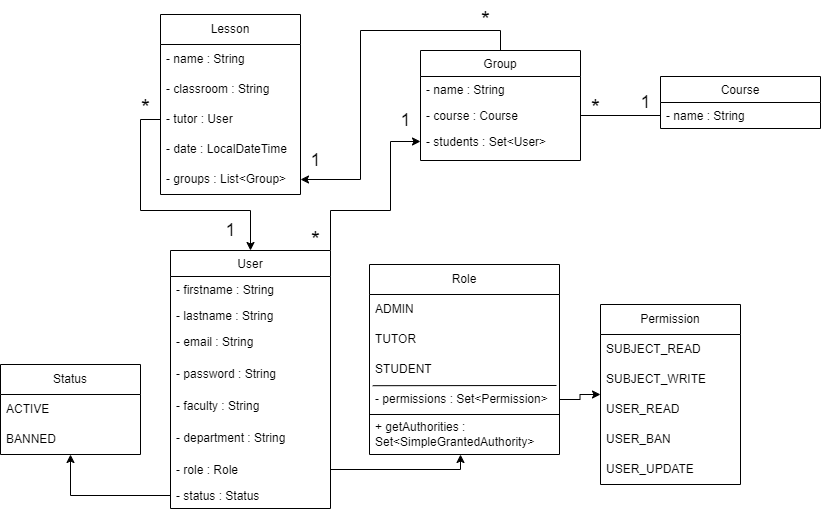

# university-cms

 

## Description Of UML diagram

Lesson is part of timetable

name : name of subject

classroom : name of class at university, for example 202A

tutor : lecturer of lesson (User with role TUTOR). Lesson can be holded by many of Tutors

date : date of lesson

groups : groups of student, who listen lecture

## User Stories

### Student

- Can view own schelude flow
- Schould see schedule according with selected date/range filter

### Tutor

- Has all possibilities as a Student
- Can update schedule: change classroom, date of lesson, etc. or cancel lesson

### Admin

- Has all possibilities as a Tutor
- Can add Student to Group
- Can change role of user
- Can ban or unban user
